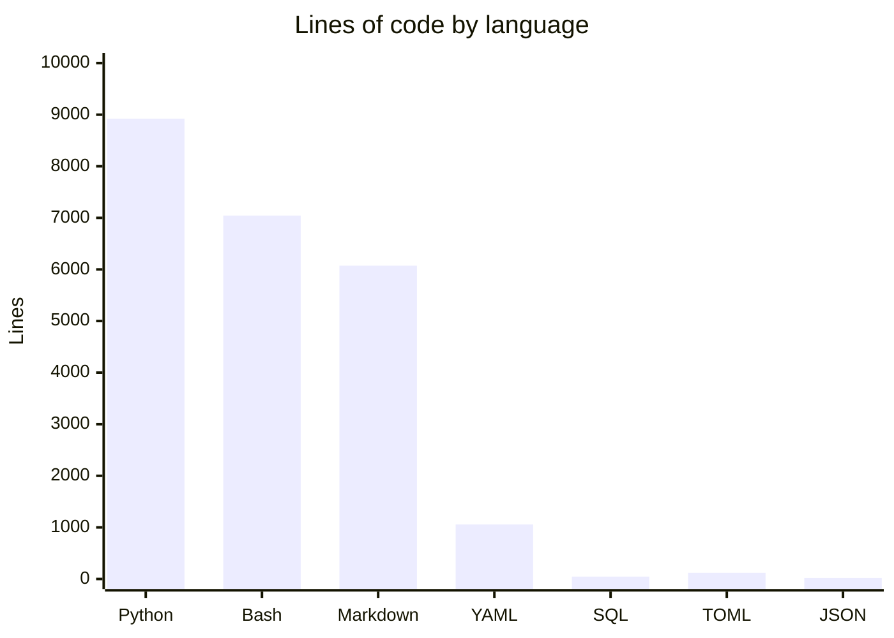

# By the numbers

Data collected on 2026-06-28.

## Size

| Metric | Count |
|---|---|
| Python files | 15 |
| Shell scripts | 37 |
| Markdown files | 61 |
| YAML files | 15 |
| SQL schema files | 2 |
| Total source files | ~139 |
| Executable facades (bin/) | 19 |
| Shared skills | 10 |
| Registry files | 9 |
| Test files | 7 |

## Activity

As of 2026-06-28, the repository has 2 commits visible in the public history, representing the initial open-source publication and a follow-up cleanup. Full activity metrics depend on the private development history.

## Bot-attributed commits

The public commit history does not contain bot-co-authored commits. This is a lower bound on AI-assisted work since inline AI tools like GitHub Copilot leave no trace in git history.

## Complexity

| Directory | Avg file size (lines) | Files |
|---|---|---|
| `memory/core/` | ~2,200 | 12 |
| `scripts/` | ~1,200 | 23 |
| `bin/` | ~240 | 19 |
| `registry/` | ~200 | 9 |
| `skills/shared/` | ~1,500 (per SKILL.md) | 10 |

The deepest import chains are in the memory system: `short_term.py` (~967 lines) and `promote.py` (~1,067 lines) are the two largest source files. The `recall_hook.py` (~670 lines) and `session_compress.py` (~950 lines) are also substantial.

## Key source files

| File | Lines | Purpose |
|---|---|---|
| `memory/core/short_term.py` | 967 | SQLite short-term memory backend |
| `memory/core/promote.py` | 1,067 | Memory promotion pipeline |
| `memory/core/session_compress.py` | 950 | Session compression |
| `memory/core/recall_hook.py` | 670 | Cross-tier recall hook |
| `scripts/gate-release.sh` | 450 | Authoritative release gate |
| `scripts/skill_health.py` | 1,700 | Skill health checking |
| `scripts/recall.sh` | 330 | Memory recall script |
