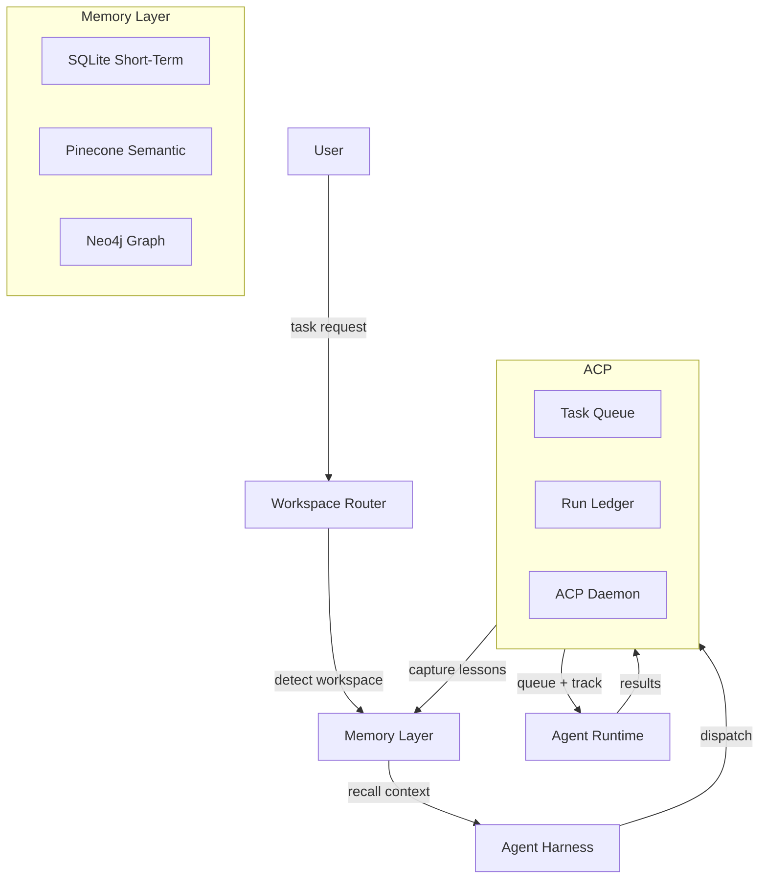
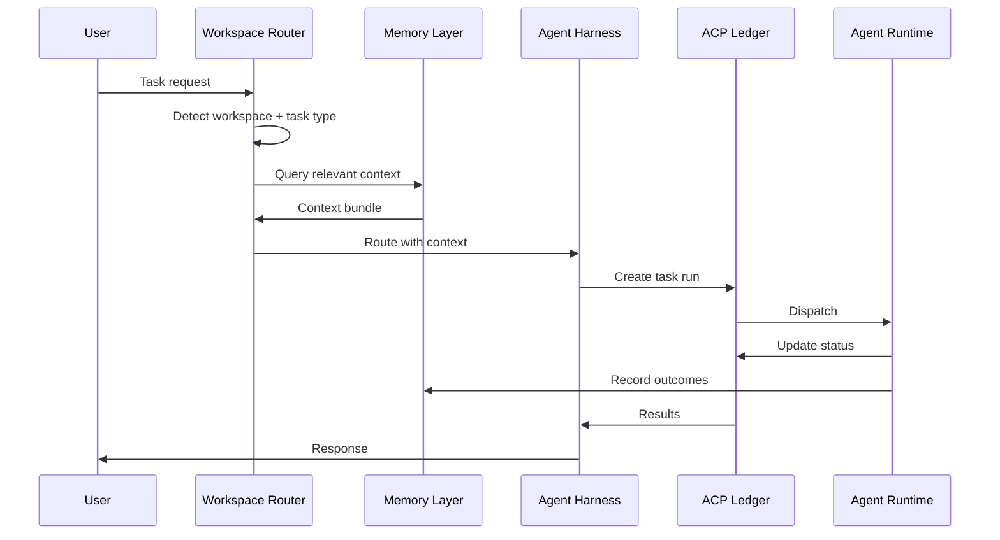
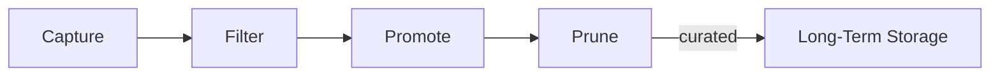

# Architecture

Active contributors: regimelab, kevin

## Purpose

Agent OS is an agent-agnostic harness that provides shared memory, cross-agent dispatch, workspace routing, and enforced governance for AI coding agents. This page describes the high-level architecture and how the main components connect.

## Four main components



| Component | Role | Why it matters |
|---|---|---|
| **Workspace Router** | Detects the active workspace and loads its rules | Prevents one domain's assumptions from contaminating another |
| **Memory Layer** | Combines short-term events, semantic search, and graph relationships | Gives agents relevant context without dumping full history |
| **ACP (Agent Communication Protocol)** | Durable task ledger from queue to completion | Makes agent work resumable, inspectable, and auditable |
| **Agent Harness** | Launches the selected agent runtime with the right tools and context | Different models and CLIs handle the work they're best suited for |

## Request flow



1. **Task arrives** — user asks a question, files a job, or resumes work
2. **Route** — workspace rules and task type are detected
3. **Recall** — relevant memory is queried and merged into a context bundle
4. **Dispatch** — the right role, model, and tools are selected
5. **Capture** — useful outcomes are recorded for later promotion

## Memory layer

The memory layer captures candidate facts during work, keeps recent events close, and promotes selected knowledge into longer-lived stores.



| Tier | Backend | Default | Purpose |
|---|---|---|---|
| Short-Term | SQLite | Always on | Recent activity, lessons, stumbles, tool output |
| Semantic | Pinecone | Optional | Vector search for cross-session recall |
| Graph | Neo4j | Optional | Entity relationships, provenance, source tracking |

## ACP dispatch flow

ACP is the durable task ledger. Each task gets a run directory with objective, current state, timestamps, and append-only transition log.

```
queued → claimed → running → review/resume → succeeded | failed | cancelled
```

### Agent roles

| Role | Purpose | Model profile |
|---|---|---|
| Explorer | Research and codebase discovery | Fast, broad context |
| Architect | Design and specification writing | High reasoning, structured output |
| Executor | Implementation and focused changes | Balanced speed and accuracy |
| Reviewer | Quality gates and skeptical review | Careful, detail-oriented |
| Escalation | Hard tasks cheaper models can't finish | Higher capability, selective use |

## Workspace routing

Each workspace has its own boot contract, tool policy, and memory scope. When an agent starts, the router detects the current directory, reads the matching rules, classifies the task, and builds a scoped context bundle. This separation is the main safety feature — a lesson from one codebase must not silently become guidance for another.

## Resilience

- **Idempotent jobs** — indexers and promotion can rerun safely
- **Source-first** — indexed data can be rebuilt from source documents
- **Partial failure tolerance** — if one memory tier is down, others continue
- **Retry queues** — failed compression/promotion replays later
- **Prunable memory** — curated, not an unbounded archive

## Key source files

| File | Purpose |
|---|---|
| `docs/ARCHITECTURE.md` | Architecture overview |
| `docs/SYSTEM_ARCHITECTURE_SOURCE_OF_TRUTH.md` | Canonical architecture reference |
| `docs/MEMORY_USER_GUIDE.md` | Memory system user guide |
| `memory/core/short_term.py` | SQLite short-term memory backend |
| `memory/core/recall_hook.py` | Cross-tier recall hook |
| `memory/core/promote.py` | Memory promotion pipeline |
| `bin/acp-task` | ACP task dispatch CLI |
| `bin/acp-daemon` | ACP daemon process |
