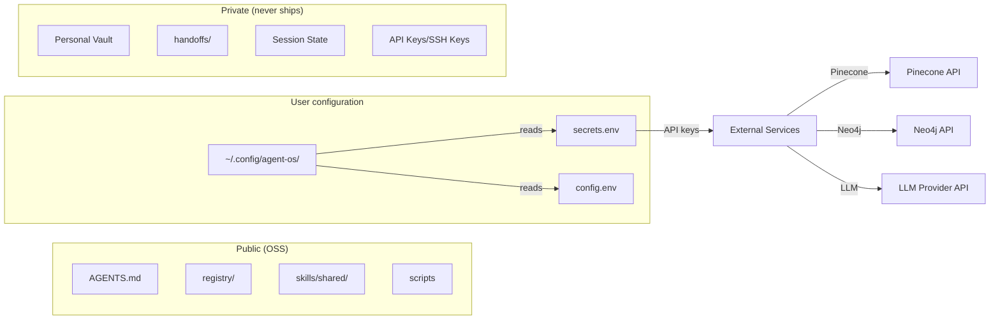

# Security

## Purpose

Agent OS has several security boundaries and privacy controls. This page documents the security model, trust boundaries, and how the system protects sensitive information.

## Security boundaries

### Privacy boundary

Agent OS maintains a strict privacy boundary between public and private content, defined in `PRIVACY_BOUNDARY.md`. The boundary is enforced by:

- **Export manifest** (`EXPORT_MANIFEST.yaml`) — an allowlist that defines exactly which files may enter the public distribution
- **Privacy gate** (`tests/privacy/privacy_gate.sh`) — scans all shipped content for prohibited patterns
- **Denylist patterns** — .env files, SQLite databases, private keys, credentials, personal content are always blocked

### Secret handling

- No secrets are included in the distribution
- `config.env.template` and `.env.template` contain placeholder values only
- `secrets.env` is created by `install.sh` with placeholder comments
- Users must provide their own API keys in `~/.config/agent-os/config.env`
- Secrets files are created with `chmod 600` permissions

### Hard rules security

Several hard rules (`registry/hard_rules.yaml`) have security implications:

| Rule | Security rationale |
|---|---|
| Never commit secrets to version control | Prevents credential exposure |
| Use absolute paths only | Prevents path traversal ambiguity |
| No git operations for ACP workers | Prevents unauthorized repository modification |
| Verify claims against live state | Prevents acting on stale, potentially misleading docs |

## Trust boundaries

### What the open-source distribution contains

- Local SQLite memory with CLI entry points
- Ten curated shared skills
- Public-only registries, scripts, setup documentation, and health checks
- Optional Pinecone and Neo4j adapter contracts
- CodeGraph and ACPx reference docs (external dependencies, not bundled)

### What is never included

- Owner identifiers (usernames, emails, home directory paths)
- Private repositories and vault contents
- API keys, SSH keys, certificates, tokens
- Runtime state (SQLite databases, caches, agent state)
- Personal content (notes, drafts, proposals, handoffs)
- Private MCP servers and deployment configurations

## Input validation

The `command-risk-check` tool (`bin/command-risk-check`) provides a risk assessment layer for shell commands, classifying them as safe, caution, danger, or critical based on the command and arguments.

## External service security

| Service | Data sent | Authentication |
|---|---|---|
| LLM Provider (OpenAI/Anthropic/etc.) | Prompts, context | API key in `config.env` |
| Pinecone (optional) | Memory vectors | API key in `secrets.env` |
| Neo4j (optional) | Graph data | URI + credentials in `secrets.env` |

All optional services are opt-in and only activate when their credentials are configured.

## Release scanning

Before each release, the following scans are executed:

1. **Owner identifier scan** — no owner-specific usernames or paths
2. **Private path scan** — no private absolute paths
3. **Service identifier scan** — no private service identifiers
4. **Secret scan** — no API keys, tokens, or credentials in content
5. **File type scan** — no .env, .sqlite, .db, .pem files
6. **Registry consistency** — all registry entries resolve to shipped files
7. **YAML validity** — all YAML files parse without errors
8. **Path resolution** — all `$AGENT_OS_HOME/` paths resolve to existing files

## Key source files

| File | Purpose |
|---|---|
| `PRIVACY_BOUNDARY.md` | Privacy boundary definition |
| `COMMERCIAL_BOUNDARY.md` | Commercial vs open-source boundary |
| `RELEASE_READINESS.md` | Release security documentation |
| `EXPORT_MANIFEST.yaml` | Export allowlist |
| `tests/privacy/privacy_gate.sh` | Privacy scanning gate |
| `registry/hard_rules.yaml` | Security-related hard rules |
| `bin/command-risk-check` | Command risk assessment |
