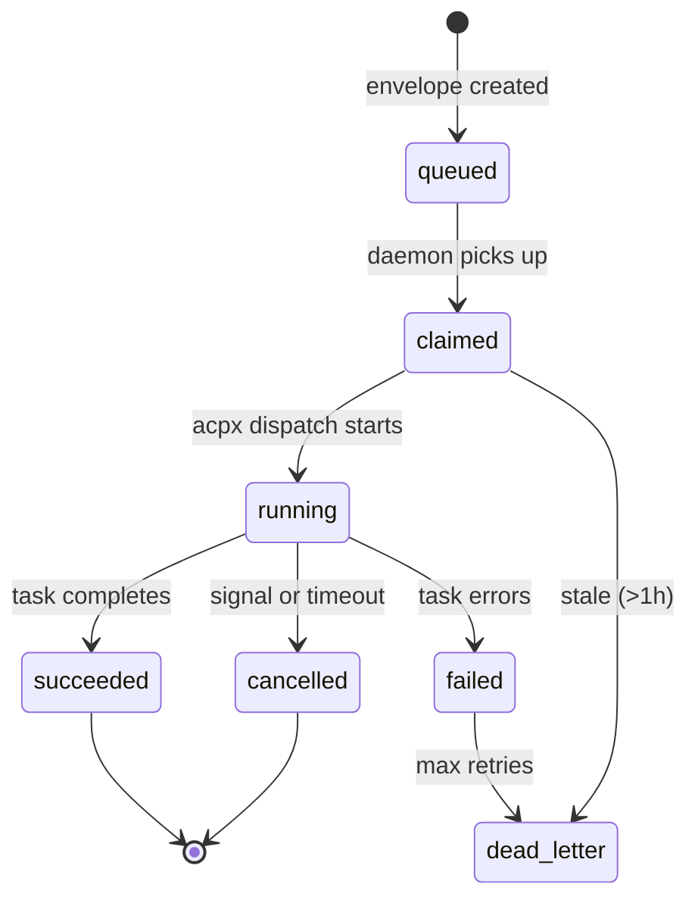
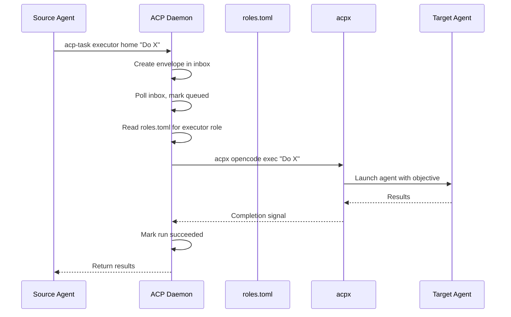

# ACP (Agent Communication Protocol)

Active contributors: kevin

## Purpose

ACP (Agent Communication Protocol) is Agent OS's durable task ledger and cross-agent dispatch system. It provides filesystem-based message routing between agents, a state machine for tracking task lifecycle, and persistent run records. ACP enables agents running on different models (Claude, Codex, OpenCode, Pi, Gemini) to delegate work to each other, with the guarantee that every task is recorded, auditable, and resumable.

## Key abstractions

| Abstraction | Description |
|---|---|
| **Task envelope** | A JSON file placed in an inbox directory containing role, workspace, objective, and optional body/session/JSON flags |
| **Inbox** | Per-workspace directory (`inboxes/workspaces/<workspace>/`) where task envelopes are queued |
| **Run directory** | A persistent directory under `runs/` that tracks each task's objective, current state, timestamps, and append-only transition log |
| **Daemon** | `acp-daemon` polls inbox directories, picks up envelopes, marks them claimed, and dispatches via `acpx` to the configured agent |
| **State machine** | `queued → claimed → running → succeeded | failed | cancelled` |
| **Role** | A configured agent profile (explorer, architect, executor, reviewer, etc.) with a provider and model assignment in `roles.toml` |
| **ACPx** | The universal agent launcher (external MIT dependency, `npm install -g acpx`) that provides persistent named sessions, crash reconnect, and multi-agent flow runner |
| **Agent mail** | `agent-mail` provides inter-agent async messaging — send, inbox, read — for agents to communicate outside of task dispatch |
| **Health check** | `acp-health` verifies daemon aliveness, inbox backlog count, and dead letter count |
| **Provider smoke** | `acp-provider-smoke` dispatches a test prompt to each configured provider and validates output |
| **Dead letter** | Envelopes that cannot be dispatched are moved to `dead_letters/` for inspection |

## How it works

### Task lifecycle

### Dispatch flow

### Details

1. **Enqueue** — An agent or user calls `acp-task <role> <workspace> "<objective>"` which writes a JSON envelope to the workspace's inbox directory
2. **Dispatch** — The `acp-daemon` polls inboxes every 5 seconds, picks up envelopes, reads `roles.toml` to determine the provider/model, marks the envelope as claimed, and dispatches via `acpx <agent> exec`
3. **Run tracking** — Each task gets a run directory with objective, current state, timestamps, and an append-only transition log (`events.jsonl`)
4. **Completion** — On success, the run is marked as succeeded and results are available. On failure, envelopes go to dead letters after max retries or 1 hour staleness
5. **Health** — `acp-health` checks daemon PID, inbox backlog, and dead letter count. `acp-provider-smoke` tests all configured providers

### Agent roles

| Role | Default provider | Use for |
|---|---|---|
| explorer | opencode/deepseek-v4-flash-free | Codebase search, discovery |
| architect | claude | Design and specification writing |
| executor | codex | Implementation and focused changes |
| reviewer | claude | Light review pass |
| code_reviewer | codex | Deep code review |
| escalation | claude | Hard tasks cheaper models cannot finish |
| hard_escalation | claude | Maximum capability tasks |

### Dispatch modes

| Flag | Mode | Session lifetime |
|---|---|---|
| (none) | One-shot | Created for one prompt, torn down after |
| `--session <name>` | Persistent named session | Lives across dispatches, survives crashes |
| (flow runner) | Multi-agent DAG | Per-run, mixed profiles |

## Integration points

| Integration | How it connects |
|---|---|
| **Memory system** | ACP workers use `memory-inject` to receive scoped memory context before starting work |
| **Boot routing** | `BOOT_FACTS.yaml` tracks `acp_daemon_running` state |
| **Hard rules** | ACP-dispatched workers must not use `git add`, `commit`, `push`, `checkout`, `reset`, `stash`, or `branch` (enforced by `no_git_for_acp` rule) |
| **Agent workflows** | The `agent-workflows` skill provides multi-agent patterns (swarm, council, dialogue, redteam, orchestrate) built on top of ACP |
| **Agent mail** | `agent-mail` provides async inter-agent messaging complementary to task dispatch |

## Key source files

| File | Purpose |
|---|---|
| `bin/acp-task` | ACP task dispatch CLI — enqueues envelopes for the daemon |
| `bin/acp-daemon` | ACP daemon — polls inboxes and dispatches to agents via acpx |
| `bin/acp-health` | ACP health check — verifies daemon aliveness, inbox backlog, dead letters |
| `bin/acp-provider-smoke` | Provider smoke test — dispatches test prompts to all configured providers |
| `bin/agent-mail` | Inter-agent async messaging tool |
| `scripts/acp-daemon-setup.sh` | Install ACP daemon auto-start (systemd or crontab) |
| `skills/shared/acp/SKILL.md` | ACP skill definition — cross-agent task dispatch documentation |
| `.config/agent-workflows/roles.toml` | Agent role assignments — maps roles to provider/model |
| `.config/agent-workflows/acp/acp_send.py` | ACP send script — writes envelopes to inboxes |
| `.config/agent-workflows/acp/acp_completion.py` | ACP completion handler — processes task results |
