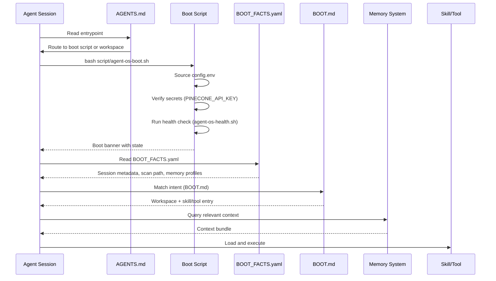

# Boot routing

## Purpose

Boot routing is the initialization sequence that every Agent OS agent follows when starting a session. It translates a user's task request into the correct workspace context, loads the appropriate rules and skills, builds a scoped context bundle from memory, and routes the task to the right agent role. The boot sequence ensures that agents never start cold — they always have access to relevant prior lessons, workspace-specific rules, and the system's current state.

## Key abstractions

| Abstraction | Description |
|---|---|
| **AGENTS.md** | The entrypoint contract that every agent must read first. Routes to the boot script or workspace-specific rules. |
| **BOOT.md** | The intent router — a trigger-match table that maps user request intents to workspace, boot sequence, and skill/tool entry. |
| **BOOT_FACTS.yaml** | The canonical boot facts document. Contains session metadata (date, version, distribution), scan path for required reads, memory profiles, system state (ACP daemon status, memory health, active workspaces). |
| **Workspace** | A user-created directory with its own AGENTS.md entrypoint, tool policy, and memory scope. Registered in `registry/workspaces.yaml`. |
| **Context bundle** | The scoped set of memory records, rules, and workspace configuration built during boot. |
| **Boot script** | `scripts/agent-os-boot.sh` — sources config, verifies secrets, runs health checks, prints the boot banner. |
| **Intent routing** | The process of matching a user's request (e.g., "recall X", "dispatch task") to a skill or tool entry in BOOT.md. |

## How it works

### Boot sequence

### Detailed flow

1. **Entry** — The agent reads `AGENTS.md` first. If it has a task assignment or is resuming work, it runs `scripts/agent-os-boot.sh` immediately
2. **Config loading** — The boot script sources `~/.config/agent-os/config.env` (or fallback `config.env`), which sets `AGENT_OS_HOME`, `LLM_PROVIDER`, `LLM_API_KEY`, and other environment variables
3. **Secrets verification** — `secrets.env` is sourced. If `PINECONE_API_KEY` is present, it is validated (must start with `pcsk_`, not be a placeholder)
4. **Health check** — `agent-os-health.sh` runs, printing the status of all memory tiers, ACP daemon, and workspace configuration
5. **Boot facts** — The agent reads `docs/BOOT_FACTS.yaml`, which provides session metadata, the scan path of required reads (`every_agent` files first, then role-specific files), available memory profiles, and current system state
6. **Intent routing** — The agent matches the user's request against the trigger table in `BOOT.md`. The table maps intents like "remember this", "recall X", "dispatch task to agent" to the correct workspace, boot sequence, and skill/tool entry
7. **Workspace detection** — If the task belongs to a workspace, the router reads that workspace's `AGENTS.md`, tool policy, and memory scope. Workspaces are registered in `registry/workspaces.yaml`
8. **Context building** — The agent queries the memory system for relevant prior lessons, stumbles, and decisions, building a scoped context bundle
9. **Skill execution** — The matched skill is loaded and executed with the built context

### Intent routing table

| Trigger phrase / intent | Workspace | Boot | Skill / Tool entry |
|---|---|---|---|
| "remember this", "capture lesson", friction signal | cockpit | none | `lesson` skill |
| "recall X", "find lessons about X" | cockpit | none | `recall` skill |
| "show me what was learned", "summary of recent lessons" | cockpit | none | `digest` skill |
| "audit docs", "check doc quality" | cockpit | none | `doc-audit` skill |
| "dispatch task to agent", "delegate to" | cockpit | none | `acp` skill |
| "hand off to higher model" | cockpit | none | `upward-handoff` skill |
| "audit changes", "trace fixes" | cockpit | none | `changes-review` skill |

No match? A single clarifying question is asked — no guessing across workspaces.

### Reading order

When booting into a workspace, agents read in this order:

1. `AGENTS.md` — what the project is and its rules
2. `docs/MEMORY.md` — last session: what was done, decisions
3. `docs/LESSONS.md` — gotchas and corrections (always-active rules)

## Integration points

| Integration | How it connects |
|---|---|
| **Memory system** | Boot queries memory for context; memory health is checked during boot |
| **ACP** | `BOOT_FACTS.yaml` tracks `acp_daemon_running` system state |
| **Registry** | `registry/workspaces.yaml` defines available workspaces for routing |
| **Hard rules** | Rules like `verify_before_trusting` govern boot behavior |
| **Config system** | `config.env` and `secrets.env` are sourced during boot |

## Key source files

| File | Purpose |
|---|---|
| `AGENTS.md` | Agent entrypoint — routes to boot script or workspace-specific rules |
| `BOOT.md` | Intent router — trigger-match table for mapping requests to skills |
| `docs/BOOT_FACTS.yaml` | Canonical boot facts — session metadata, scan path, memory profiles, system state |
| `scripts/agent-os-boot.sh` | Boot wrapper — sources config, verifies secrets, runs health check |
| `scripts/agent-os-health.sh` | Health check — verifies memory tiers, ACP, workspace configuration |
| `registry/workspaces.yaml` | Workspaces registry — defines available workspaces and their paths |
