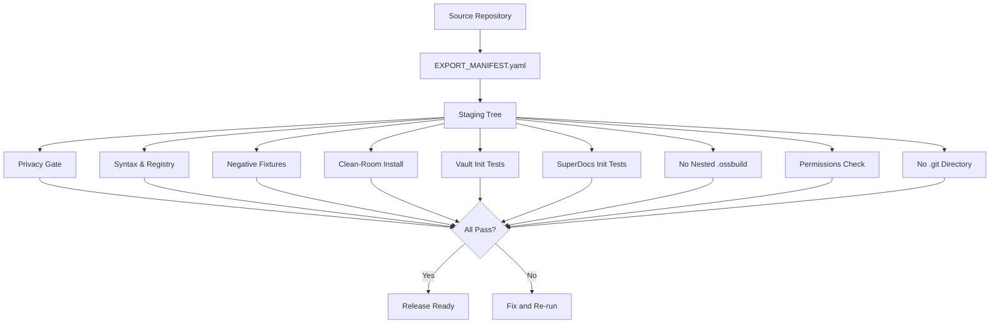

# Gates and release

Active contributors: kevin

## Purpose

The gates and release system ensures that Agent OS public distributions are clean of private data, structurally valid, and installable by new users. It consists of validation gates that scan for prohibited content, verify syntax and registry consistency, prove clean-room installability, and enforce the export allowlist defined in `EXPORT_MANIFEST.yaml`. The authoritative release gate (`gate-release.sh`) consolidates all checks into a single entry point.

## Key abstractions

| Abstraction | Description |
|---|---|
| **Privacy gate** | Scans all shipped content for owner identifiers, private paths, service identifiers, API keys, credentials, and other prohibited patterns. Implemented in `tests/privacy/privacy_gate.sh`. |
| **Release gate** | Authoritative gate that runs all validations: privacy, syntax, registry, negative fixtures, clean-room install, Vault init, SuperDocs init, permissions, and Git metadata check. Implemented in `scripts/gate-release.sh`. |
| **Clean-room gate** | Verifies the staging area has no build artifacts, caches, or temporary files. Implemented in `scripts/gate-cleanroom.sh`. |
| **Clean-room installation test** | Proves that a new user can install Agent OS in an isolated temporary HOME without access to the owner's machine, private repositories, or services. Runs 86+ checks. Implemented in `tests/clean-room/install_and_verify.sh`. |
| **Export manifest** | `EXPORT_MANIFEST.yaml` — an allowlist-based system that defines exactly which files may enter the staging tree. Only paths listed in the manifest are shipped. |
| **Privacy boundary** | `PRIVACY_BOUNDARY.md` — documents what ships, what is excluded, and how maintainers verify that private material did not cross the boundary. |
| **Release readiness** | `RELEASE_READINESS.md` — confirms the public candidate is a curated duplicate with no private runtime state, credentials, or personal content. |

## How it works

### Release gate flow

### Release gate checks (9 categories)

| # | Gate | Checks | Script |
|---|---|---|---|
| 1 | Privacy | 23 checks — owner identifiers, private paths, service identifiers, API keys, file types, registry consistency, path resolution | `tests/privacy/privacy_gate.sh` |
| 2 | Syntax & Registry | Required files present, YAML validity, Python AST validity, shell syntax validity, registry entries resolve to shipped files | `scripts/gate-release.sh` (embedded) |
| 3 | Negative fixtures | Prohibited patterns in test fixtures are correctly detected | `scripts/gate-release.sh` (embedded) |
| 4 | Clean-room install | 86+ checks — isolated HOME, installer idempotency, CLI availability, config placement, first memory write/recall | `tests/clean-room/install_and_verify.sh` |
| 5 | Vault init | 9 checks — Vault OS scaffold initialization | `scripts/gate-release.sh` (embedded) |
| 6 | SuperDocs init | 27 checks — SuperDocs scaffold initialization | `scripts/gate-release.sh` (embedded) |
| 7 | No nested .ossbuild | Ensure no .ossbuild directory exists under shipped directories | `scripts/gate-cleanroom.sh` |
| 8 | Permissions & dangling | Check file permissions and missing commands | `scripts/gate-release.sh` (embedded) |
| 9 | No .git | Ensure no .git directory is present in the staging tree | `scripts/gate-release.sh` (embedded) |

### Privacy gate checks

The privacy gate (`tests/privacy/privacy_gate.sh`) runs 23 distinct scans:

| Gate | What it finds |
|---|---|
| Owner username | Scans for `$OWNER_USERNAME` (configured per-user, whitelisted in PRIVACY_BOUNDARY.md and gate scripts themselves) |
| Project refs | Scans for RegimeLab, Regime_Lab, Kwant_Back, kwant |
| API key values | Scans for `api_key = <value>` patterns |
| Token values | Scans for token strings 20+ characters |
| Password values | Scans for password assignments |
| Private env files | Scans for `.env`, `.env.local`, `.env.prod` |
| Cloud provider IDs | Scans for DigitalOcean, Hetzner, AWS_ACCESS |
| Internal IPs | Scans for private IP ranges |
| Production domains | Scans for external service URLs |
| Personal file paths | Scans for `/home/username`, `/Users/username` |

### Export manifest workflow

`EXPORT_MANIFEST.yaml` is an allowlist-based export system. The workflow:

1. The manifest defines `allowlist` sections, each pointing to a `source` directory and listing `files` to include
2. A `denylist` section lists patterns that are always blocked (`.env`, `*.sqlite`, `*.db`, `*.pem`, credentials, `node_modules/`, `handoffs/`, `droid-wiki/`, `.ossbuild/`, etc.)
3. The staging tree is built by copying only files that match the allowlist and do not match the denylist
4. Before each release, the release gate verifies that the staging tree matches the manifest

### Clean-room verification

The clean-room installation test (`tests/clean-room/install_and_verify.sh`) proves:

1. **Isolation** — HOME is a temporary directory with no pre-existing Agent OS state, config, or private keys
2. **Installation** — `install.sh` executes successfully, creates `config.env` and `secrets.env`
3. **Idempotency** — Running `install.sh` a second time is safe and produces the same result
4. **CLI availability** — All CLI facades in `bin/` are executable and produce expected output
5. **Memory operations** — A first-use memory write and recall succeeds
6. **No original-tree mutation** — The installer does not modify the source repository

## Integration points

| Integration | How it connects |
|---|---|
| **Privacy boundary** | `PRIVACY_BOUNDARY.md` defines what ships and what is excluded; gates enforce it |
| **Export manifest** | `EXPORT_MANIFEST.yaml` is the allowlist that gates validate against |
| **Release readiness** | `RELEASE_READINESS.md` documents the verification steps that gates automate |
| **Hard rules** | Rules like `no_secrets_in_repos` are enforced by the privacy gate scans |
| **Boot routing** | Clean-room test verifies boot scripts work in an isolated environment |

## Key source files

| File | Purpose |
|---|---|
| `scripts/gate-release.sh` | Authoritative release gate — runs all validations (9 categories) |
| `scripts/gate-privacy.sh` | Privacy gate — scans staging area for private/sensitive content |
| `scripts/gate-cleanroom.sh` | Clean-room gate — verifies no build artifacts, caches, or temp files |
| `tests/privacy/privacy_gate.sh` | Agent OS privacy gate — 23 scans for prohibited patterns |
| `tests/clean-room/install_and_verify.sh` | Clean-room installation test — 86+ checks in isolated HOME |
| `PRIVACY_BOUNDARY.md` | Privacy boundary — documents what ships, what is excluded, verification process |
| `RELEASE_READINESS.md` | Release readiness — confirms the public candidate is a curated duplicate |
| `EXPORT_MANIFEST.yaml` | Export manifest — allowlist-based system defining what files enter the staging tree |
