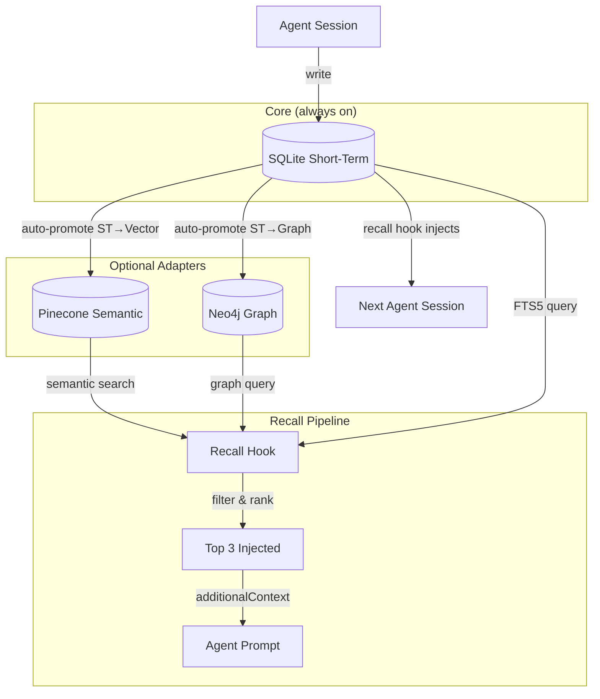

# Memory

Active contributors: kevin

## Purpose

The memory system provides cross-session, cross-agent recall for Agent OS. It follows a **core-plus-adapters** architecture: a local SQLite short-term store is always available, while optional Pinecone (vector semantic) and Neo4j (graph relationship) adapters add longer-lived tiers. The system captures lessons, stumbles, decisions, and confirmed facts during agent work, keeps recent events close, and promotes selected knowledge into longer-lived stores for recall by future sessions.

## Key abstractions

| Abstraction | Description |
|---|---|
| **Short-Term Memory (ST)** | Local SQLite database with FTS5 full-text search. Always on, zero configuration. Records agent activity with intents like LESSON, STUMBLE, DECISION, CONFIRMED. |
| **Semantic Memory** | Optional Pinecone vector index. Enables cross-session recall by semantic similarity. Activated when `PINECONE_API_KEY` is set. |
| **Graph Memory** | Optional Neo4j graph database. Stores relationships between agents, lessons, workspaces, and topics. Activated when `NEO4J_URI` is set. |
| **Record** | A single entry in short-term memory with id, run_id, agent_id, workspace, intent, kind, content, summary, source_ref, status, and timestamps. |
| **Promotion** | The pipeline that validates and moves short-term records into long-term (Pinecone/Neo4j) storage. |
| **Recall Hook** | A per-prompt hook that auto-injects relevant prior lessons into agent sessions via the `additionalContext` contract. |
| **Citation** | Provenance tracking for memory retrievals. Each retrieval is wrapped with a `cit-*` ref that persists to a citations SQLite database for audit. |
| **Ledger** | Append-only audit ledger for Neo4j graph mutations. Every CLAIM_ADDED, INVALIDATED, and RETIRED event is recorded immutably and idempotently. |
| **Injection** | Packet-scoped memory injection that queries all active tiers via the `memory-recall` facade to produce a scoped `memory_context` for agent packets. |
| **Session Compression** | Compresses a finished agent session into 3-5 durable facts, appends to memory, and upserts each fact to Pinecone. |
| **Memory Profile** | A combination of active tiers: Local/Core (SQLite only), Semantic (SQLite + Pinecone), Graph (SQLite + Neo4j), Full (all three). |

## How it works

The memory system records candidate facts during agent work, keeps recent events accessible via FTS5 keyword search, and promotes selected knowledge into longer-lived stores.

### Promotion pipeline

### Flow

1. **Capture** — Agents write records via `memory-st write --intent LESSON --summary "..." --source-ref cli:...`
2. **Store** — Records land in the SQLite short-term database at `$AGENT_OS_HOME/.local/state/agent-os/memory/short_term.sqlite`
3. **Promote** — `promote.py` validates records (checks for denied patterns, hedging language, raw transcripts, duplicates) and promotes eligible records to Pinecone (vector) and/or Neo4j (graph) when configured
4. **Recall** — On each agent prompt, the recall hook (`recall_hook.py`) queries all active tiers, filters by score floor and quality gates, ranks by tier priority, and injects the top 3 results as an `<agent_os_memory>` block
5. **Provenance** — Each retrieval is wrapped with a citation ref (`cit-*`) persisted to SQLite for audit, and graph mutations are recorded in the append-only ledger
6. **Compress** — After a session ends, `session_compress.py` compresses the session into 3-5 durable facts, appends them to memory, and upserts to Pinecone

## Integration points

| Integration | How it connects |
|---|---|
| **Boot routing** | Memory health is checked via `scripts/agent-os-health.sh` during boot |
| **ACP dispatch** | ACP workers use `memory-inject` to query memory for packet context |
| **Agent hooks** | The recall hook intercepts every UserPromptSubmit via the agent's hook system |
| **CI/CD** | Health gates verify memory tier availability during release |
| **CLI tools** | `memory-st`, `memory-lt`, `memory-promote`, `memory-recall`, `memory-recall-safe`, `memory-inject` are the user-facing CLIs |
| **Agent voice** | Agents use `agent-voice` to emit lessons that flow into the promotion pipeline |

## Key source files

| File | Purpose |
|---|---|
| `memory/core/short_term.py` | SQLite short-term memory backend — CLI for `memory-st` |
| `memory/core/recall_hook.py` | Per-prompt recall hook that auto-injects prior lessons |
| `memory/core/promote.py` | Promotion pipeline — validates and promotes ST records to long-term storage |
| `memory/core/inject.py` | Packet memory injection — produces scoped `memory_context` for agent packets |
| `memory/core/citation.py` | Citation token module — provenance tracking for memory retrievals |
| `memory/core/ledger.py` | Append-only audit ledger for Neo4j graph mutations |
| `memory/core/session_compress.py` | Session compression — compresses finished sessions into durable facts |
| `memory/core/schema_short_term.sql` | SQLite schema for short-term memory records and FTS5 index |
| `memory/core/schema_neo4j.cypher` | Neo4j graph schema — constraints and node/relationship definitions |
| `memory/core/schema_citations.sql` | SQLite schema for citation tracking database |
| `memory/core/auto_approve_policy.json` | Auto-approval policy for memory promotion |
| `memory/adapters/pinecone/ADAPTER.md` | Pinecone adapter documentation |
| `memory/adapters/neo4j/ADAPTER.md` | Neo4j adapter documentation |
| `registry/memory_tiers.yaml` | Source of truth for the Agent OS memory stack — tier definitions and status |
| `docs/MEMORY_USER_GUIDE.md` | Practical reference for working with Agent OS memory |
